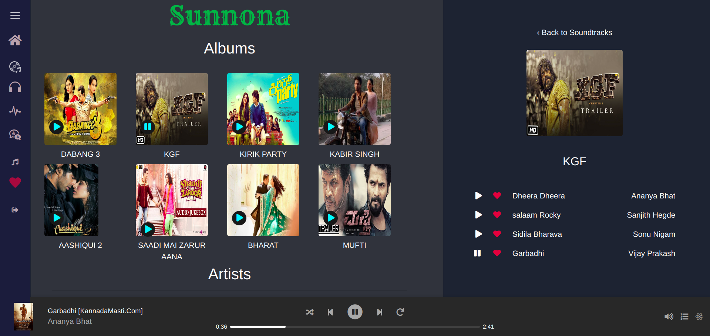
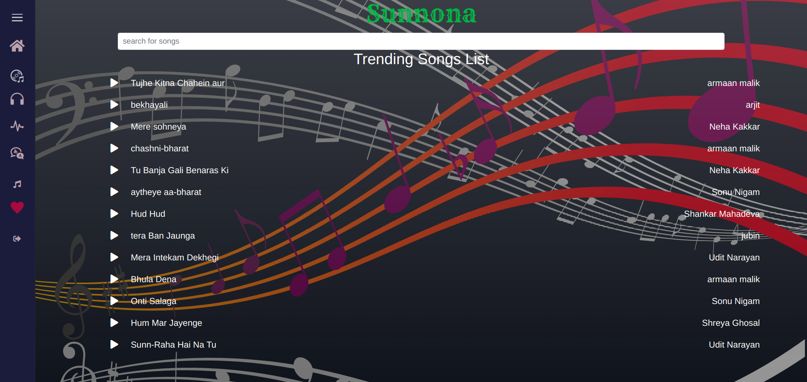
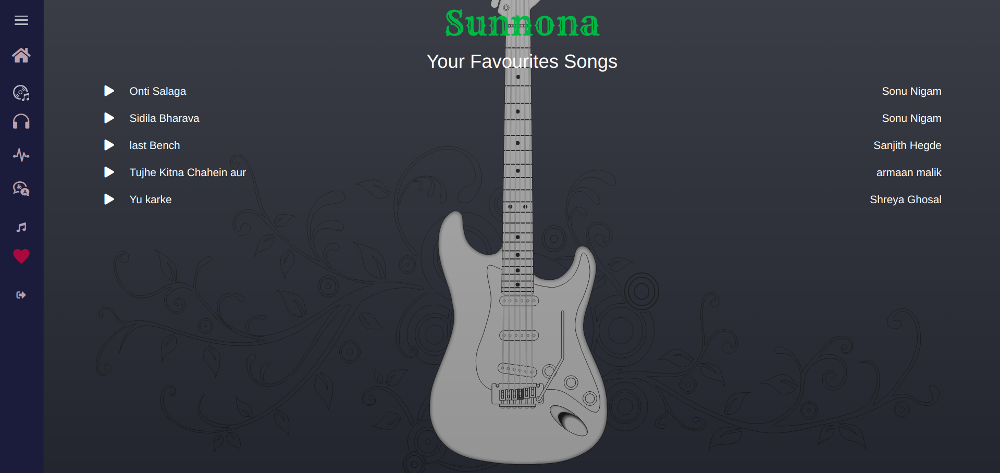
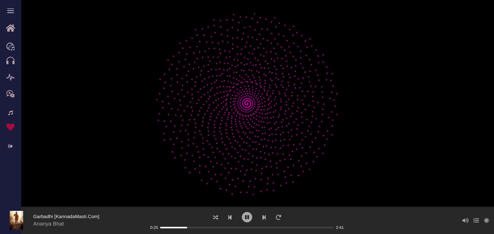
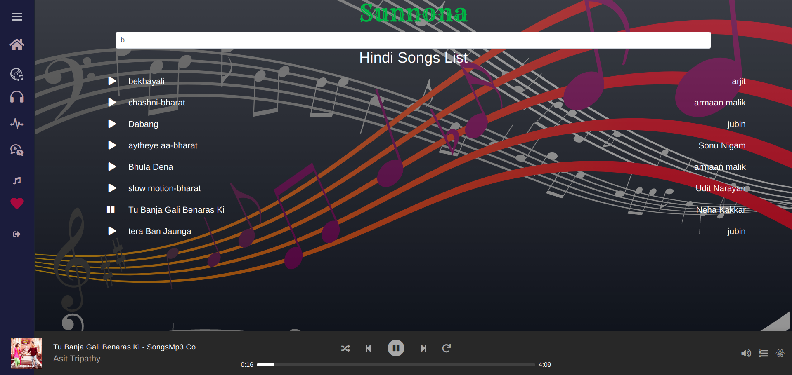
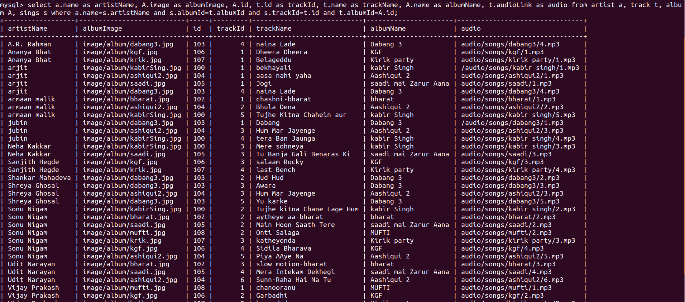
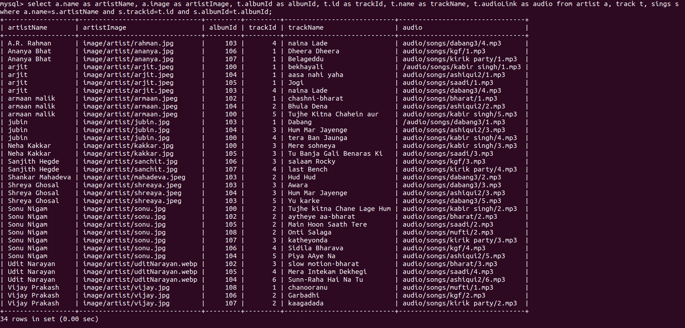

# sunnona
DBMS Online Music player Application. In this application we managed and learnt how big company like spotify, gaana.com etc.. manages their application on user level and as admin level. In this application user are provided with various functionality to listen to music on their mood and privileges. user can add or remove a songs from favourite list etc..

## Demo

## Demo Images
### Home page having list of all album, artist, genre...

### Trending songs based upon number of listener of songs with search functionality.

### list of user favourite songs.

### animated graphics.

### Hindi songs (langauge classification).

### Database query to get all songs of album.

### Database query to get all songs of artist.

